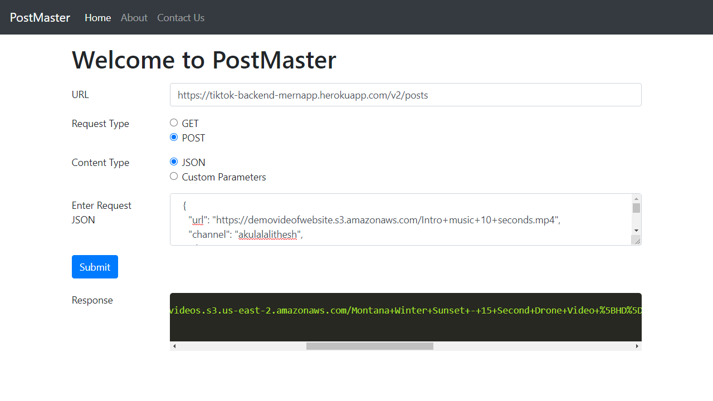

# linkedin-clone

[Website](https://lalithesh11.github.io/PostManApp/)

### Overview of the project:

It is a <strong>Postman-clone</strong> where i implemented the GET & POST method functionalities.

### Steps:

1. To test the GET method API, provide URL and select Request type as GET and click on Submit. The Response can be viewed in Response window.
2. For POST method, we can give input in two ways. One way is, we can provide the content type as JSON. And the other way is we can provide the custom paramters.
3. So, to test the POST API, simply provide URL, select Request Type as POST, select the Content Type as required and simply click on Submit to view the response.
4. The best part is we can copy the reponses.

Technologies used are <strong>HTML, CSS, VanillaJS</strong>